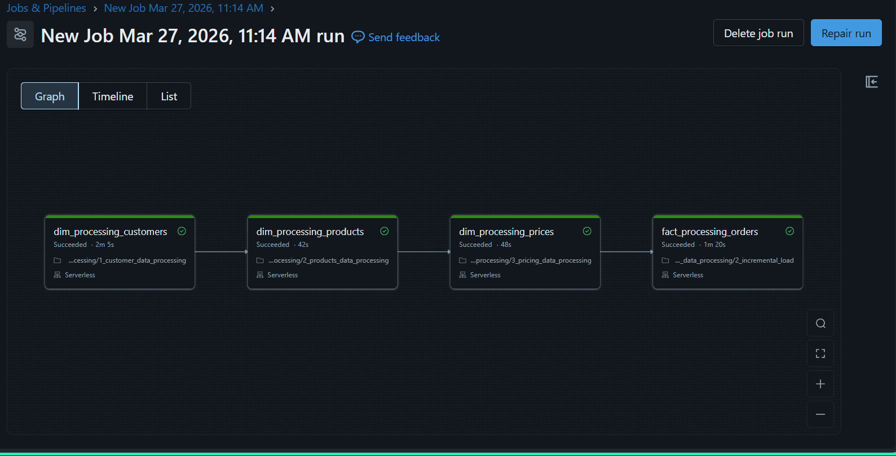

# SportsBar Data Pipeline

**Databricks Pilot Evaluation Report**

**Prepared by:** Pawan Kumar Rai  
**Date:** 27th March, 2027

---

## Executive Summary

Atlikon, a global manufacturer of sports equipment, and SportsBar, a fast-growing startup in the energy bars and athletic nutrition segment, recently underwent a strategic merger.

While Atlikon operates on mature ERP-driven systems, SportsBar's data workflows rely heavily on spreadsheets, cloud drives, WhatsApp exports, and inconsistent APIs.

This disparity led to severe challenges in reporting, forecasting, and cross-company planning. To evaluate a unified, scalable platform capable of handling both structured ERP data and messy, semi-structured startup data, a pilot was conducted on **Databricks Free Edition**.

This repository contains the complete data pipeline implementation, documentation, and evaluation findings.


---

## Table of Contents

- [Project Overview](#project-overview)
- [Key Findings](#key-findings)
- [Architecture](#architecture)
- [Folder Structure](#folder-structure)
- [Data Pipeline](#data-pipeline)
- [Setup & Configuration](#setup--configuration)
- [Usage](#usage)
- [Dashboarding](#dashboarding)
- [Recommendations](#recommendations)
- [Next Steps](#next-steps)

---

## Project Overview

### Objectives

The primary goals of this pilot were:

1. **Evaluate scalability** to handle Atlikon's ERP exports and SportsBar's unstructured data flows
2. **Assess Databricks' ability** to unify multiple formats and broken reporting cycles
3. **Test features** such as Delta Lake, Dashboards, Genie AI, and image visibility
4. **Determine suitability** for building a single, reliable data layer across the merged entity

### Scope

- **Parent Company (Atlikon):** Structured ERP data with full load and incremental load patterns
- **Child Company (SportsBar):** Semi-structured data from multiple sources (orders, products, pricing)
- **Pipeline Pattern:** Bronze → Silver → Gold architecture using Delta Lake

---

## Key Findings

### Scalability Assessment

| Aspect | Finding |
|--------|---------|
| **Cluster Scalability** | Serverless compute handled both large ERP datasets and dense transactional history efficiently. No cluster provisioning or DevOps involvement needed. |
| **ETL Performance** | Delta Lake significantly improved merge performance and incremental updates, especially for correcting missing months in SportsBar's data. |

### Adoption Assessment

| Aspect | Finding |
|--------|---------|
| **Learning Curve** | ~2 weeks of focused exploration for full end-to-end execution. Intuitive for engineers with Python/SQL background. |
| **Team Skill Fit** | Smooth adaptation for teams already using Python. SQL workflows and Delta Tables support analytics use cases. |
| **Migration Complexity** | Minimal code refactoring required. Main effort: reorganizing multi-source exports into repeatable ingestion framework. |

### Unification Assessment

Databricks combines the capabilities of a **data lake**, **data warehouse**, and **ETL engine** into a unified platform.

---

## Architecture


### Lakehouse Architecture

```
┌─────────────────────────────────────────────────────────────────┐
│                        DATABRICKS LAKEHOUSE                      │
├─────────────────────────────────────────────────────────────────┤
│                                                                  │
│  ┌──────────────┐    ┌──────────────┐    ┌──────────────┐       │
│  │   BRONZE     │    │    SILVER    │    │    GOLD      │       │
│  │  (Raw Data)  │───▶│ (Cleansed)   │───▶│ (Aggregated) │       │
│  └──────────────┘    └──────────────┘    └──────────────┘       │
│         │                   │                   │                │
│         ▼                   ▼                   ▼                │
│   Delta Lake          Delta Lake          Delta Lake            │
│   (Append)            (Merge/Update)      (Analytics)           │
│                                                                  │
└─────────────────────────────────────────────────────────────────┘
```

### Pipeline Flow

```
┌─────────────────────────────────────────────────────────────────────┐
│                         DATA SOURCES                                 │
│  ┌─────────────────┐              ┌─────────────────────────────┐   │
│  │  Atlikon (ERP)  │              │  SportsBar (Multi-Source)   │   │
│  │  - Structured   │              │  - Spreadsheets             │   │
│  │  - Full Load    │              │  - Cloud Drives             │   │
│  │  - Incremental  │              │  - WhatsApp Exports         │   │
│  │                 │              │  - Inconsistent APIs        │   │
│  └─────────────────┘              └─────────────────────────────┘   │
└─────────────────────────────────────────────────────────────────────┘
                              │
                              ▼
┌─────────────────────────────────────────────────────────────────────┐
│                      INGESTION LAYER (Bronze)                        │
│  ┌─────────────────────────────────────────────────────────────┐    │
│  │  Raw data loaded into Delta Tables (full + incremental)     │    │
│  └─────────────────────────────────────────────────────────────┘    │
└─────────────────────────────────────────────────────────────────────┘
                              │
                              ▼
┌─────────────────────────────────────────────────────────────────────┐
│                    PROCESSING LAYER (Silver)                         │
│  ┌─────────────────────────────────────────────────────────────┐    │
│  │  - Data cleansing & validation                              │    │
│  │  - Deduplication                                            │    │
│  │  - Schema enforcement                                       │    │
│  │  - Dimension tables (Customer, Product, Pricing)            │    │
│  └─────────────────────────────────────────────────────────────┘    │
└─────────────────────────────────────────────────────────────────────┘
                              │
                              ▼
┌─────────────────────────────────────────────────────────────────────┐
│                     ANALYTICS LAYER (Gold)                           │
│  ┌─────────────────────────────────────────────────────────────┐    │
│  │  - Fact tables (Orders, Transactions)                       │    │
│  │  - Aggregated metrics                                       │    │
│  │  - Business-ready datasets                                  │    │
│  │  - Dashboard-ready views                                    │    │
│  └─────────────────────────────────────────────────────────────┘    │
└─────────────────────────────────────────────────────────────────────┘
                              │
                              ▼
┌─────────────────────────────────────────────────────────────────────┐
│                      CONSUMPTION LAYER                               │
│  ┌─────────────────┐    ┌─────────────────┐    ┌─────────────────┐  │
│  │   Dashboards    │    │    Reports      │    │     BI Tools    │  │
│  │   (Databricks)  │    │   (SQL)         │    │   (PowerBI,     │  │
│  │                 │    │                 │    │    Tableau)     │  │
│  └─────────────────┘    └─────────────────┘    └─────────────────┘  │
└─────────────────────────────────────────────────────────────────────┘
```



---

## Folder Structure

```
SportsBar-pipeline/
│
├── README.md                          # This file
├── QUICKSTART.md                      # Quick reference guide
│
├── images/                            # Project images & diagrams
│
├── docs/                              # Documentation & reports
│
├── data/                              # Source data files
│   ├── 1_parent_company/             # Atlikon (Parent Company) ERP data
│   │
│   └── 2_child_company/              # SportsBar (Child Company) data
│
└── code/                              # Jupyter notebooks
    ├── 01_setup/                     # Initial setup & configuration
    │   ├── dim_date_table_creation.ipynb
    │   ├── setup_catalog.ipynb
    │   └── utilities.ipynb
    │
    ├── 02_dimension_data_processing/ # Dimension table processing
    │   ├── 1_customer_data_processing.ipynb
    │   ├── 2_products_data_processing.ipynb
    │   └── 3_pricing_data_processing.ipynb
    │
    ├── 03_fact_data_processing/      # Fact table processing
    │
    └── 04_dashboarding/              # Dashboard queries & configs
```

---

## Data Pipeline

### Pipeline Stages

#### 1. Setup Phase
- Create Unity Catalog structure
- Set up schemas (Bronze, Silver, Gold)
- Create dimension date table
- Configure access controls

#### 2. Dimension Data Processing
- **Customer Data:** Cleansing, standardization, deduplication
- **Product Data:** Hierarchy mapping, attribute enrichment
- **Pricing Data:** Price history tracking, effective date management

#### 3. Fact Data Processing
- **Full Load:** Initial historical data migration
- **Incremental Load:** Daily delta updates with SCD Type 2 support

### Data Flow

```
Source Systems → Bronze (Raw) → Silver (Cleansed) → Gold (Analytics) → Dashboards
```

---

## Setup & Configuration

### Prerequisites

1. **Databricks Workspace** (Free Edition or higher)
2. **Unity Catalog** enabled
3. **Python 3.8+** for local development

### Initial Setup

1. **Create Catalog & Schemas**
   ```
   # Run: code/01_setup/setup_catalog.ipynb
   ```

2. **Create Dimension Date Table**
   ```
   # Run: code/01_setup/dim_date_table_creation.ipynb
   ```

3. **Configure Utilities**
   ```
   # Review: code/01_setup/utilities.ipynb
   # Update connection strings and paths as needed
   ```

### Running the Pipeline

1. Upload notebooks to Databricks Workspace
2. Execute notebooks in order:
   - `01_setup/setup_catalog.ipynb`
   - `01_setup/dim_date_table_creation.ipynb`
   - `02_dimension_data_processing/` (all notebooks)
   - `03_fact_data_processing/` (all notebooks)

---

## Dashboarding

### FMCG Dashboard

A comprehensive dashboard has been created in Databricks Lakeview for:

- **Sales Analytics:** Daily, weekly, monthly trends
- **Product Performance:** Top SKUs, category breakdown
- **Customer Insights:** Segmentation, retention metrics
- **Inventory Tracking:** Stock levels, turnover rates

### Accessing Dashboards

1. Navigate to **Dashboards** in Databricks
2. Open **FMCG Dashboard**
3. Refresh data as needed

### Denormalized Query

For custom analytics, use the denormalized view:
```
# See: code/04_dashboarding/
```

---

## Recommendations

Based on the pilot results, **Databricks is recommended** as the next-generation data infrastructure for Atlikon × SportsBar.

### Key Benefits

✅ Addresses current scaling issues  
✅ Improves governance and observability  
✅ Simplifies tooling landscape (unified storage, processing, orchestration)  
✅ Smooth adoption curve for existing data engineering team  
✅ Minimal code refactoring required  

### Next Steps

1. **Leadership Review:** Present this report to Bruce and the leadership team
2. **Cost-Benefit Analysis:** Conduct detailed pricing analysis based on projected workloads
3. **Focused Pilot:** Run a second pilot on a non-critical pipeline if required
4. **Migration Planning:** Design phased migration approach
5. **Training Plan:** Upskill data engineering and analytics teams

---

## Next Steps

### Immediate Actions

| Action | Owner | Timeline |
|--------|-------|----------|
| Leadership presentation | Data Team Lead | Week 1 |
| Cost-benefit analysis | Finance + Data Team | Week 2-3 |
| Training plan design | HR + Data Team | Week 3 |
| Migration roadmap | Data Architects | Week 4 |

### Migration Phases

```
Phase 1: Foundation (Month 1-2)
├── Setup production Databricks environment
├── Configure Unity Catalog & access controls
└── Migrate 1-2 non-critical pipelines

Phase 2: Core Migration (Month 3-4)
├── Migrate Atlikon ERP data pipelines
├── Migrate SportsBar core data pipelines
└── Implement monitoring & alerting

Phase 3: Optimization (Month 5-6)
├── Performance tuning
├── Advanced analytics implementation
└── Dashboard rollout to business users

Phase 4: Decommission (Month 7+)
├── Phase out legacy systems
├── Knowledge transfer
└── Continuous improvement
```

---

## Contact & Support

**Report Author:** Pawan Kumar Rai  
**Department:** Data Engineering  

For questions about this pilot or implementation, please reach out to the Data Engineering team.

---

## Appendix

### Pilot Scope Summary

- **Platform:** Databricks Free Edition
- **Pipeline:** Bronze → Silver → Gold architecture
- **Data Volume:** Synthetic data aligned with current production scales
- **Features Tested:** Notebooks, Delta Lake, Dashboards

### Resources

- [Databricks Documentation](https://docs.databricks.com/)
- [Delta Lake Documentation](https://docs.delta.io/)
- [Unity Catalog Overview](https://docs.databricks.com/en/data-governance/unity-catalog/index.html)

---

*Last Updated: 27th March, 2027*
